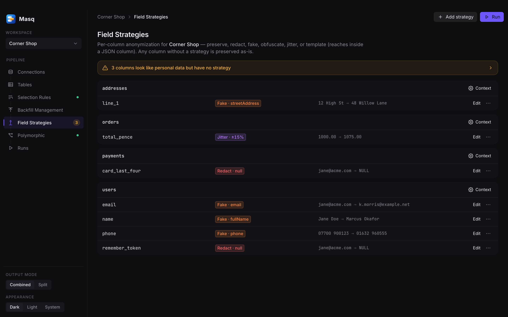
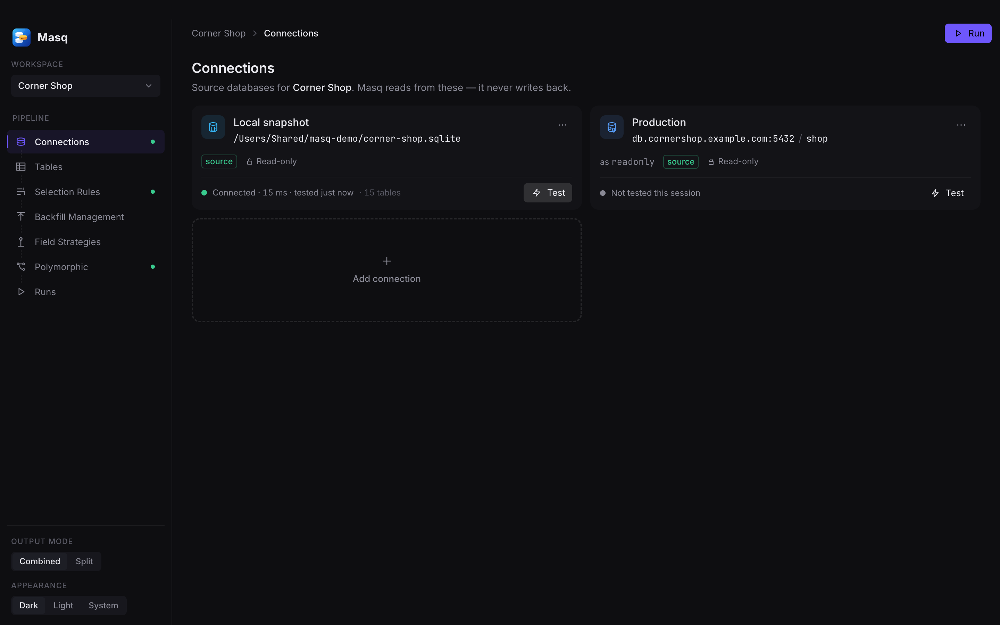
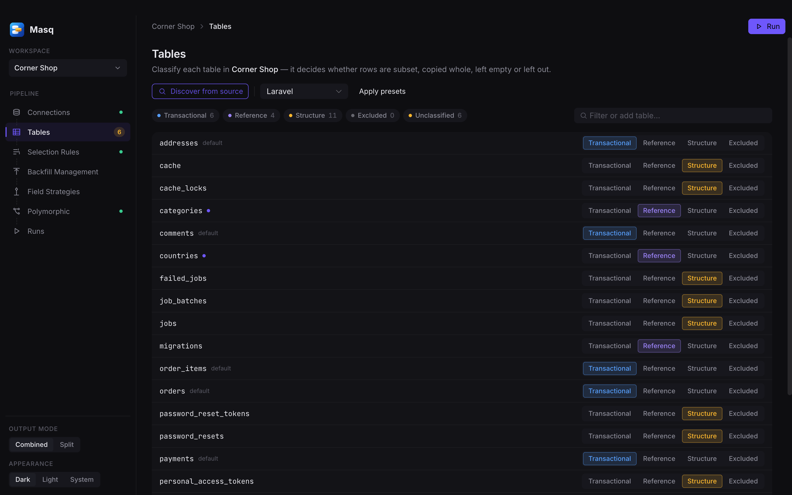
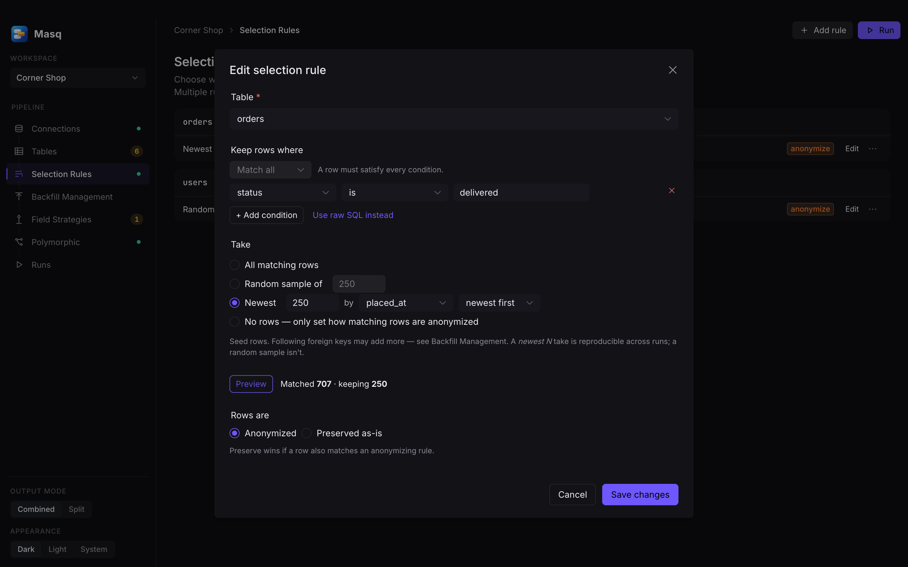
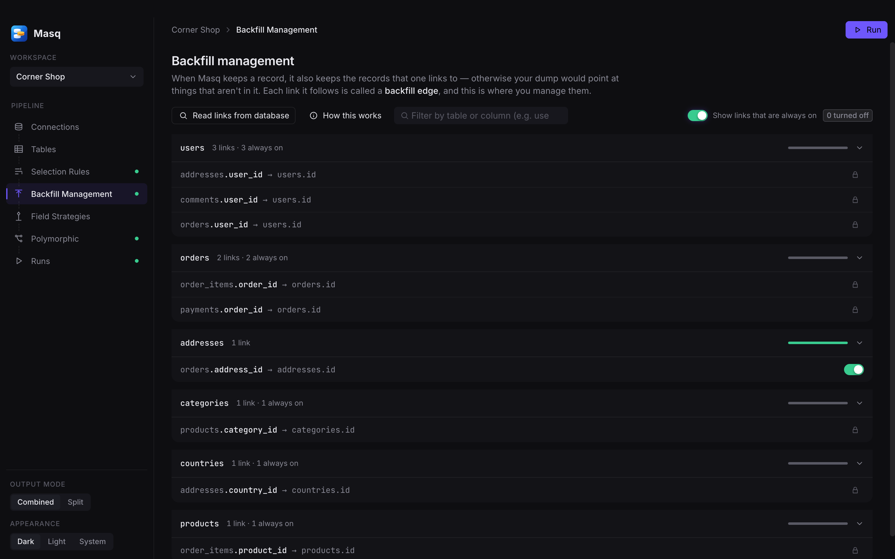
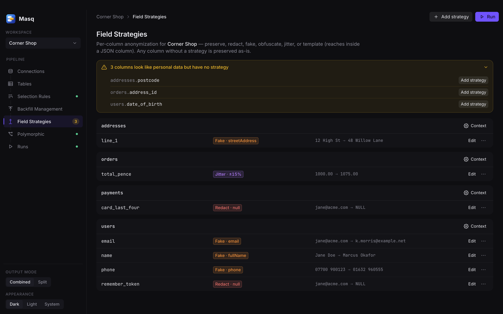
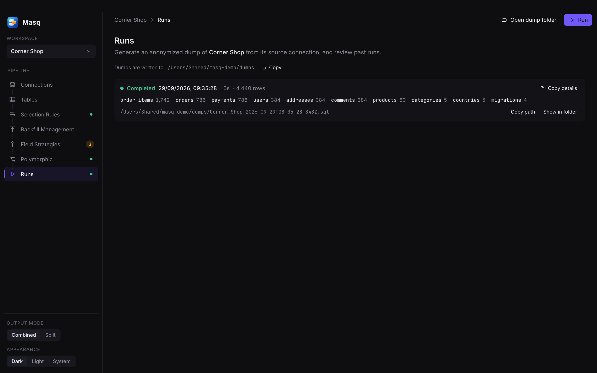
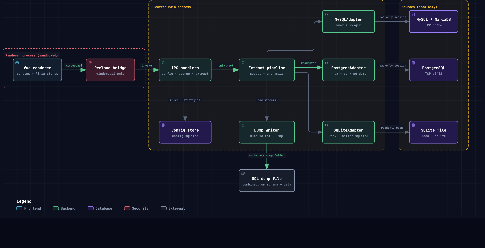

<p align="center">
  
</p>

<h1 align="center">Masq</h1>

<p align="center">
  <strong>Create realistic local database subsets with configurable anonymization.</strong>
</p>

<p align="center">
  MySQL · PostgreSQL · SQLite &nbsp;·&nbsp; macOS · Windows · Linux &nbsp;·&nbsp; <em>alpha: run from source</em>
</p>

<p align="center">
  <picture>
    <source media="(prefers-color-scheme: light)" srcset="docs/screenshots/field-strategies-light.png">
    
  </picture>
</p>

Masq is a desktop app that connects to a production database with a **read-only** session and picks
a small subset of it, following supported relationships. Fields with configured anonymization
strategies are transformed on the way out, and the result is a plain `.sql` file you can load into
a laptop or staging database.

Developers get data that looks and behaves like production: real distributions, real edge cases and
related rows. The person running Masq needs source credentials; developers receiving a reviewed
dump can work without access to production. A dump can still contain personal data: see
[Safe use and limitations](#safe-use-and-limitations).

> [!NOTE]
> **There are no release builds yet.** Masq is in alpha and runs locally from source. See
> [Getting started](#getting-started). Signed installers and auto-update will come with the first
> release.

## Why Masq

- **Designed for source reads.** Server connections open read-only sessions and SQLite files
  open with `readonly: true`. Use credentials restricted to reads; session settings and raw
  predicate checks are additional protections, not a security boundary for untrusted SQL.
- **Subsets that still hang together.** Masq follows foreign keys up and down, and polymorphic
  `*_type` / `*_id` links too, to bring related customers, line items and payments into the subset. Restore limits are listed below.
- **Anonymization you can reason about.** Six per-column strategies: preserve, redact, fake,
  obfuscate, jitter, and template for values inside a JSON column. Fake values are seeded from a
  stable identity, so the same person gets the same fake name in every table and on every re-run.
- **Set it up once, re-run forever.** Configuration lives in a _workspace_, one per project. After
  that, producing a fresh dump is a single click.
- **Framework-aware.** Presets for **Laravel**, **Rails** and **Django** classify framework tables
  (migrations, sessions, jobs, caches) for you. Every preset is an editable default.
- **Portable output.** The output is one combined `.sql` file, or schema and data files if you'd
  rather split them. Load it with the tools you already use.

## Getting started

There's nothing to download yet, so you run Masq from a clone of this repository. You need
Node.js 22.12 or newer, npm and git. CI uses Node.js 22. Native-module installation may also
require your platform's C/C++ build tools. On Linux, Electron needs desktop libraries and an
unlocked GNOME Keyring or KWallet to save passwords securely.

For PostgreSQL, install `pg_dump` and make it available on `PATH`. Its major version must be at
least the source server's major version. It is not bundled with Masq.

```bash
git clone https://github.com/phibrenet/Masq.git
cd Masq
npm install        # also downloads Electron and rebuilds better-sqlite3 for it
npm run dev        # opens the app
```

To get a standalone app you can launch without a terminal, run `npm run build:unpack`. The app is
written to `dist/` (for example `dist/mac-arm64/Masq.app` on Apple Silicon). You built it yourself,
but the resulting app is unsigned and unnotarized; OS security prompts may still apply.

On first launch Masq opens with some example workspaces. Add a connection to your own database,
then work down the sidebar.

## How it works

Each step lives on its own page in the sidebar, in pipeline order.

### 1. Connect

Add a source database: MySQL/MariaDB, PostgreSQL or a SQLite file. Passwords go into the OS keychain
through Electron `safeStorage` and never leave the main process.



### 2. Classify tables

Discover every table and say what should happen to it. **Transactional** tables are subset,
**reference** tables are copied whole, **structure** tables keep their schema but no rows, and
**excluded** tables are left out. Framework presets handle the boilerplate in one click.



### 3. Choose which rows to keep

Selection rules pick the seed rows for each table. A rule can take all matching rows, a random
sample or the newest _N_, filtered by conditions or a raw `WHERE`. **Preview** counts the matches
against the live source before you save.



### 4. Follow the links

Masq reads the foreign keys from the database and follows them, so the rows your seeds point to come
along too. Backfill Management shows every edge it will follow and lets you switch off the optional
ones. Polymorphic relations, which have no foreign key, can be detected from the data and declared
in a couple of clicks.



### 5. Anonymize

Give each sensitive column a strategy and see a before-and-after preview. Masq flags columns that
look like personal data but have no strategy yet. This is a column-name heuristic: it can miss
sensitive values in other columns or inside JSON. Review every included table and field.



### 6. Run

Click **Run** to stream the subset through the anonymizer and write a dump file. Each run records
what it kept, table by table.



## Architecture

<picture>
  <source media="(prefers-color-scheme: light)" srcset="docs/screenshots/architecture-light.png">
  
</picture>

The renderer is sandboxed and only sees a narrow, typed `window.api`. Everything that touches a
database runs in the main process, which uses one adapter per dialect. Rows stream from the source
through the anonymizer and straight into the dump writer. There's an
[interactive version of this diagram](docs/diagrams/dialect-connections.html) (open it in a
browser) with a trace mode, presentation view and export. It will also be published at
**<https://phibrenet.github.io/Masq/>** once the repository is public.

For the security model (assets, trust boundaries and the code that enforces each one), see
[THREAT_MODEL.md](THREAT_MODEL.md).

## Status

**Alpha.** MySQL, PostgreSQL and SQLite adapters are implemented. MySQL has the most live-use
validation; automated fixtures do not establish compatibility with every schema or server version.
Expect rough edges, and please report them. SQL Server is planned for v2, and SSH tunnelling to private databases is
designed ([docs/ssh-tunnel.md](docs/ssh-tunnel.md)) but not built yet. There are no release builds
yet ([Getting started](#getting-started) covers running from source). Packaging, signing and
auto-update are the next milestone.

## Safe use and limitations

- Use a database account restricted to reads, preferably against a read replica. Masq's read-only
  session settings do not replace database permissions. Raw predicates are trusted SQL; review them
  in imported workspaces before previewing or running. The potential PostgreSQL session-setting
  bypass remains unverified and unmitigated (see [threat model §5](THREAT_MODEL.md#5-known-weaknesses-and-open-items)).
- Columns without a field strategy remain unchanged. Reference tables are copied whole without
  anonymization. Preserve rules override anonymization when selections overlap. The PII warning is
  advisory, and deterministic fake/obfuscated values do not guarantee that people cannot be identified.
- Inspect dumps before sharing, including JSON, free text and reference data. Treat workspace
  exports and logs as potentially sensitive too. A completed run is not a privacy certification.
- Known restore limits include PostgreSQL cyclic foreign keys and custom-type dependencies omitted
  by per-table `pg_dump`, foreign keys targeting non-primary-key columns, and possible UNIQUE
  collisions from obfuscation. Review run warnings and test a restore into a disposable database.
- Selection and streaming do not share a consistent source snapshot. Concurrent changes can affect
  the result, and relationships may remain unresolved when backfill is disabled or unsupported.
- Dump files can include `DROP`/`TRUNCATE` statements. Restore into a disposable local database,
  after reviewing the file. Do not point a restore at production.
- Signed installers, auto-update and broad platform/restore validation are still pending. The
  existing suite exercises local fixtures; it does not replace live server and packaged app checks.

See [SECURITY.md](SECURITY.md) for private vulnerability reporting and
[CONTRIBUTING.md](CONTRIBUTING.md) for contributing and validation instructions.

## Development

Set up as in [Getting started](#getting-started). `npm run dev` hot-reloads the renderer.

```bash
npm test           # unit + integration tests (run under Electron's Node)
npm run lint && npm run typecheck
npm run build:mac  # or build:win / build:linux: produce installers (unsigned)
```

If `npm run dev` fails with `Error: Electron uninstall`, the Electron binary didn't download during
install. Run `node node_modules/electron/install.js` and try again.

## Tech stack

Electron (`electron-vite`) · Vue 3 + TypeScript · Pinia · Naive UI · `knex` with `mysql2` / `pg` /
`better-sqlite3` · `@faker-js/faker` · `electron-builder` · Electron `safeStorage` for credentials.
The app's own settings live in a local SQLite file. Passwords are stored there only as encrypted
blobs through `safeStorage`; rule values, connection details and workspace exports may themselves
contain sensitive information.

## Project layout

- `src/main`: Electron main process (adapters, extract pipeline, dump writer, config store)
- `src/preload`: the typed bridge exposed to the renderer
- `src/renderer`: the Vue app
- `docs/`: the [full spec](docs/db-subsetter-spec.md), design notes and diagrams
- `.memory/`: team-shared project context (`decisions.md`, `state.md`, `glossary.md`)
- [`AGENTS.md`](AGENTS.md): orientation and review rules for contributors and AI agents

## License

[MIT](LICENSE)
