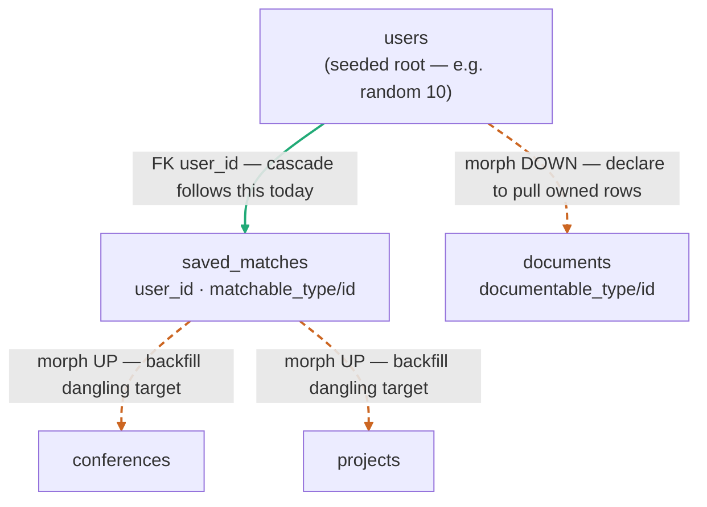
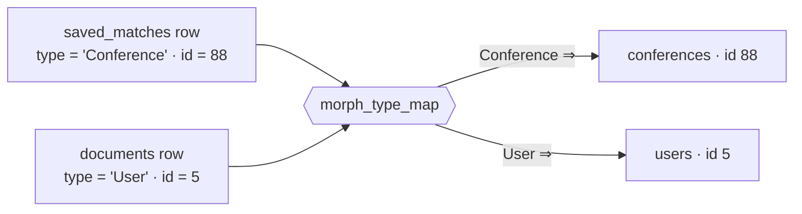

# Polymorphic (morph) relation support in the FK cascade — design plan

_Status: **BUILT** — all three stages landed 2026-07-30. Captured 2026-07-26 after a live test against
a Laravel/Postgres app; kept as the design record. Stage 1 = config + builder UI (migration 004),
stage 2 = down-cascade, stage 3 = up-backfill. See `.memory/decisions.md` for what changed during
implementation and what the live verification measured._

Teach the extract cascade to follow **polymorphic relations** — Laravel's `*_type` + `*_id` column
pairs — which carry no foreign key and are therefore invisible to the current FK-driven cascade. On
the resconx schema this is **19 of 83 tables**, so it's a first-class gap for subsetting any Laravel
app, not an edge case.

## The problem

A polymorphic relation is a pair of columns where the *type* column names the target model and the
*id* column is the primary key within that model's table:

```
saved_matches.matchable_type = 'App\Models\Conference'   matchable_id = 88   → conferences.id = 88
vector_embeddings.embeddable_type = 'App\Models\User'    embeddable_id = 5   → users.id = 5
```

Because the target table varies per row, Laravel declares **no FK constraint**. The cascade's only
structural input is `adapter.getForeignKeys()` (read from `pg_constraint`), so morph relations are
simply not seen. Two distinct failures result, both observed live:

- **Morph-only tables are never reached.** 7 of the 19 (`audits`, `notifications`, `conversations`,
  `conference_searches`, `personal_access_tokens`, `support_tickets`, `vector_embeddings`) have no
  real FK at all, so cascade can't pull them.
- **Pulled morph rows dangle.** The other 12 have a real FK too (e.g. `saved_matches.user_id →
  users`), so cascade pulls them — but their morph `*_id` points at a Conference/Project not in the
  subset, a dangling reference **no FK check can detect** because there's no constraint. This is
  invisible referential corruption on top of the 124 declared-FK orphans (see `cascade.ts` /
  `.memory` parent-backfill notes).

## Core idea

**A morph relation is a foreign key whose parent table is chosen per row by a sibling column.** So
the approach is to model it as a first-class *polymorphic edge* and feed it into the same BFS that
already walks FK edges in [cascade.ts](../src/main/extract/cascade.ts). The engine's shape barely
changes: the worklist loop gains a second edge kind alongside its `childEdges` index.



_Solid green = a declared FK edge the cascade already follows. Dashed orange = a polymorphic edge,
invisible today. **Arrow direction = the direction rows get pulled**: DOWN pulls a kept entity's
owned rows; UP backfills the target a kept row dangles at._

## Two directions — they fix different halves

A morph edge is traversable both ways, and each closes a different failure:

### Down — the "morphMany" side (coverage)

Keep User 5 → pull `documents WHERE documentable_type = 'App\Models\User' AND documentable_id = 5`.
Nearly identical to the existing FK-child step ([cascade.ts:62-80](../src/main/extract/cascade.ts)),
except the query gains `AND type = ?`. This is what makes morph-only tables actually contain the
sampled entities' rows.

### Up — the "morphTo" side (integrity / backfill)

A kept `saved_matches` row points at Conference 88 → ensure Conference 88 is in the subset. This is
the **polymorphic case of parent-backfill** (the separate `cascade.ts` enhancement, "item #2"). It's
what removes the dangling morph references.

**Key rule: backfill recurses up, not down.** Pulling Conference 88 must also pull *its* parents
(`institution_id`, etc.) or the dangle just moves. But it must **not** expand Conference 88's
children (its documents, its other matches) — otherwise one dangling reference drags in an unbounded
subtree and defeats subsetting. Backfill adds exactly the ancestor rows needed for integrity.

### Which matters for what

- **Down** = new capability; brings morph-only tables into the subset. Opt-in per relation.
- **Up** = integrity; removes the dangling morph references. Shares its mechanism with the plain-FK
  parent-backfill enhancement — "ensure these parent ids exist in table T" is the same operation
  whether T came from an FK or a resolved morph type. **Build the two together.**

Both are separable and independently testable.

## Config model

Morph relations can't be introspected *as relations*, so the user declares them — but the UI is
seeded so heavily it's confirm-not-author. New config (migration 004 or 005 — see numbering note):

```sql
morph_relations (
  id, workspace_id, table_name, type_column, id_column,
  cascade_down INTEGER,   -- opt-in: traverse this relation to pull owned rows
  backfill_up  INTEGER,   -- opt-in: pull dangling targets for integrity
  UNIQUE (workspace_id, table_name, type_column)
)
morph_type_map (
  morph_relation_id, type_value, target_table   -- one row per canonical type value
)
```

Seeding (all prototyped in the 2026-07-26 probes):

- **Auto-detect candidate pairs** — scan `information_schema.columns` for a `*_type` column with a
  matching `*_id` sibling. Found all 19 on resconx.
- **Introspect the distinct type values** present per column (`SELECT DISTINCT type_col …`).
- **Best-guess each type→table** — class basename → snake_case + pluralize → match an introspected
  table name (`App\Models\Conference` → `conferences`). User confirms/edits.

**Declaring a relation is the opt-in.** Undeclared morphs are ignored, exactly as today. This gives
direct control: you'd declare `documents`/`saved_matches` but likely *not* `vector_embeddings` (you
wanted it DDL-only) or `audits` (identifiable data you'd rather exclude).

Per-row resolution — each canonical `(type, id)` pair maps to one concrete target via the map:



## Assumptions (resolved outside Masq)

- **Type values are canonical and consistent — data hygiene is the source's job, not Masq's.** A
  column that holds the *same* logical entity under two spellings (resconx's `audits.user_type` /
  `model_has_roles.model_type` carry both `App\Models\User` and bare `user`/`admin`) is a source-data
  inconsistency, fixed **upstream** — a data cleanup, or a consistent Laravel morph map
  (`Relation::enforceMorphMap([...])`) so every row writes one canonical value. Masq maps each
  distinct type value it finds and **surfaces any it can't map** (see below); it does not try to
  reconcile duplicate spellings of one entity. (Deliberate morph-map *aliases* — different real
  targets under short names — are fully supported; that is just a normal one-value-per-target entry.)

## Other edge cases

- **Unmapped type value seen in data** → log and skip that row's edge; never silently drop. Surfacing
  it prompts the user to complete the map *or* fix the source value — consistent with the assumption
  above (Masq flags, the user resolves).
- **Null type values** → skip that row's edge (no target), no error.
- **Target PK assumption** — the morph id references the target's PK, the same assumption plain FKs
  make today ([cascade.ts:16](../src/main/extract/cascade.ts)). Composite-PK targets stay
  unsupported, consistent with the current limitation.

## Engine changes, concretely

1. **Adapter primitive (down):**
   `getRowsReferencingMorph(childTable, typeColumn, typeValue, idColumn, parentIds): {childId, parentId}[]`
   — the existing `getRowsReferencing` plus `AND typeColumn = typeValue`; same chunked-IN shape.
2. **Pre-expand morph relations into edges.** Each declared relation × its type map yields a set of
   `{parentTable, childTable, typeColumn, typeValue, idColumn}` morph edges, indexed by `parentTable`
   alongside the existing `childEdges`.
3. **Down-cascade** — in the worklist loop, when expanding a parent table, also process its morph
   edges: pull matching-type children, `mergeKeep` with preserve-wins and re-enqueue exactly as the
   FK path does. Down-cascade is genuinely "more edges."
4. **Backfill (up), shared with the plain-FK backfill** — a fixpoint pass after down-cascade: for
   each kept row carrying a morph reference, read `(type, id)`, group by type → mapped table, ensure
   those ids are present, and recurse **upward only** (their FK + morph parents). Terminates: ids are
   finite and the kept set is monotonic.
5. **Flag for backfilled rows** — a row pulled purely for integrity defaults to `anonymize = true`
   (it was never preserved); preserve-wins still applies if a rule matches it. (Open decision below.)

## Edge cases

- **Morph-only tables are never *seeded*.** With no rule and no incoming FK, a morph-only table only
  gets rows via down-cascade from a declared relation — which is the intended behaviour (declare to
  include).
- **Self-referential morphs** (a morph pointing back at its own table) — the monotonic kept-set +
  re-enqueue-on-change logic already terminates these, same as circular FKs today.
- **Backfill blow-up** — bounded by "up only": backfill can pull at most one ancestor chain per
  dangling reference, never a subtree.
- **`morph_type_map` gaps** — a type value seen in data but absent from the map → log and skip (don't
  silently drop; surfacing it lets the user complete the map).

## v1 scope

- **In:** single-column-PK targets; down-cascade and up-backfill, each opt-in per relation;
  auto-detect + best-guess seeding; a clean type-value → table map (one entry per canonical value).
- **Out (defer / not Masq's job):** composite-PK targets (matches the current cascade limit); morph
  relations whose id column isn't the target PK; **reconciling inconsistent type-value spellings —
  resolved at source (see Assumptions).**

## Open decisions

1. **Backfilled-row flag** — default `anonymize = true` (recommended) vs. inherit from the child that
   pulled it. Recommend true: a parent dragged in for integrity has no reason to be preserved.
2. **Down default on/off per relation** — recommend **off by default**; declaring + ticking
   `cascade_down` is the opt-in, so nothing changes size unless asked.
3. **Migration number** — 004 is also claimed by the template-anonymizer plan; independent features,
   so whichever lands first takes 004, the other 005.

## Staged build order — all done 2026-07-30

1. **[x] Config** — `morph_relations` + `morph_type_map`, repo/IPC/store, and the auto-detect +
   best-guess builder UI. Inert until the engine reads it, so it lands safely alone and lets you
   declare your real morphs.
2. **[x] Down-cascade** — adapter primitive + edge pre-expansion + worklist integration.
3. **[x] Up-backfill, together with the plain-FK parent-backfill** — one mechanism closes both the
   declared-FK orphans and the morph dangles. Verified via direct LEFT JOINs / kept-set comparison
   (not `VALIDATE CONSTRAINT`, which no-ops on already-valid constraints).

### What implementation added that this plan didn't anticipate

- **Composite-PK morph tables must be pre-flighted, not trusted.** Spatie's `model_has_roles` /
  `model_has_permissions` are morph-shaped with a three-column PK and get suggested by detection —
  declaring one and ticking "down" would have thrown out of the cascade and failed the whole extract.
  `filterAddressableMorphEdges` drops and reports them.
- **Backfill's seed must include morph-carrying tables.** Seeding from FK edges alone never visits a
  morph-*only* table (resconx's `audits` has zero constraints), so its references could never be
  repaired. Proven: without the union, 40 repairable `audits` dangles survive.
- **"Dangling" splits in two.** A reference whose target was deleted upstream is pre-existing source
  corruption that no backfill can repair — historical `audits` rows point at long-gone users. Masq now
  distinguishes these and reports them rather than counting them as repaired. On resconx: 40 repairable
  dangles fixed, ~20 distinct source-broken references reported.

## Appendix — the 19 morph tables on resconx_staging

Morph-only (no real FK — only reachable via down-cascade):
`audits`, `conference_searches`, `conversations`, `notifications`, `personal_access_tokens`,
`support_tickets`, `vector_embeddings`.

Morph + a real FK (pulled today, but the morph ref dangles → need up-backfill):
`ai_match_interactions`, `calendars`, `conversation_participants`, `documents`, `entitlements`,
`linked_providers`, `messages`, `model_has_permissions`, `model_has_roles`, `saved_matches`,
`support_messages`, `viewed_elements`.

Distinct target types seen in the data: `App\Models\{User, Conference, Project, Survey, Admin,
ApiClient}`, plus bare `user`, `admin` in some columns. Where a column mixes FQCN and bare spellings
of the **same** entity, that is a source inconsistency to normalise upstream (see Assumptions) — not
something Masq's map is meant to paper over.
